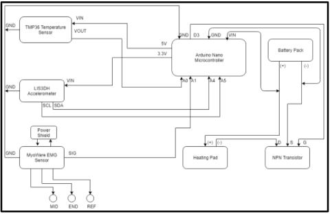
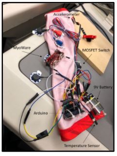
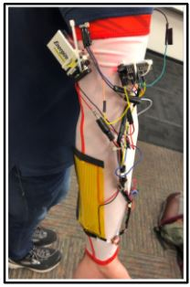

# StayWarm

Automatic Arm Warming Sleeve for people working in the cold for longer periods (ECE 8803: Biomedical Sensing Systems)

### Motivation
People who work outdoors may be exposed to extreme climates ranging from scorching heat to freezing cold.
Studies have indicated that people who repeatedly work in the cold may have a higher likelihood of experiencing hypothermia and fatal accidents
Research also shows low dexterity and highly diminished efficiency of workers, especially in labor involving handheld tools due to rapid involuntary muscle contraction and relaxation as a result of shivering.

### Objective
To develop an armsleeve containing a heating pad to decrease cold-stress and increase efficiency in manual labor tasks involving handheld objects by workers

### Approach
 
 

### Prototype

||| 
|:---:|:---:|
| Demo of Arm Sleeve on subject | Components of Arm Sleeve |
